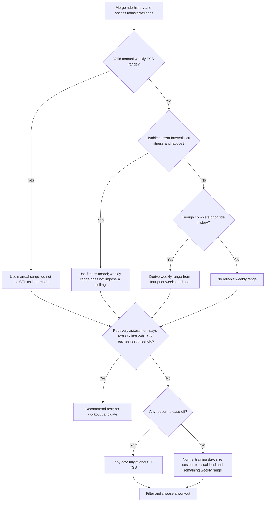
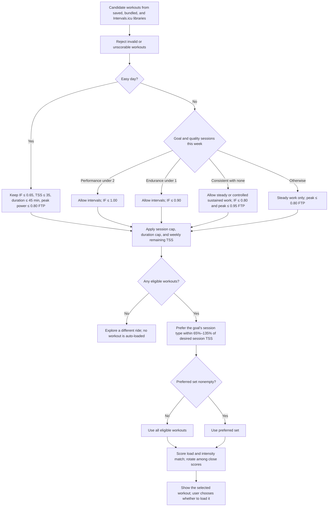

# Workout recommendation decision tree

This documents the current `WorkoutCoach.recommend` flow in
[workout_coach.dart](../lib/utils/workout/workout_coach.dart) and its recovery
assessment in
[workout_coach_recovery.dart](../lib/utils/workout/workout_coach_recovery.dart). It describes recommendations,
not a fixed training plan. Ride history is deduplicated and limited to the last
35 days; the current load window is the last 7 days.

## 1. Decide today's effort

The **ease-off** decision is yes if any of these applies:

- Today's wellness suggests easing off.
- Without the fitness model, the rolling 7-day TSS has reached the weekly
  range's lower bound or ceiling, there is no reliable range, or recent ride
  summaries are incomplete or have unknown TSS.
- The last 24 hours contain at least the recent-load threshold.
- A hard ride occurred in the last 48 hours.
- The selected goal is **Ease back in**.

The last-24-hour **rest threshold** is 100 TSS without a weekly range, or
`clamp(0.55 × weekly range high, 90, 150)` with one. The lower **recent-load
threshold**, which asks for an easy day, is 50 TSS without a range, or
`clamp(0.30 × weekly range high, 45, 80)` with one. Reaching the weekly range
alone asks for an easy day; it does not force full rest.
If a derived range exists alongside the fitness model, its high value still
influences these 24-hour thresholds, but it does not cap weekly workout TSS.

### Recovery assessment details

Only today's Intervals.icu wellness row is used for current readiness. The
fitness model requires positive fitness (CTL) and an available fatigue (ATL)
value. Form is
`CTL − ATL`; relative form is `form / CTL`.

| Result | Rule |
| --- | --- |
| Rest from modeled load | Form ≤ −30, or form ≤ −10 with relative form ≤ −0.40. |
| Ease off from modeled load | Form ≤ −5 and relative form below the goal threshold: returning −0.10, consistent −0.20, endurance −0.25, performance −0.30. |
| Rest from reported recovery | Fatigue or soreness rated 4; at least two adverse signals; or one adverse signal plus modeled ease-off. |

Adverse signals are fatigue or soreness rated at least 3, unusually low sleep,
unusually high resting heart rate, or unusually low HRV. Sleep, heart rate, and
HRV are compared with medians from at least seven measurements in the prior
28 days. Missing measurements do not count as adverse signals.

For the recent-ride gate, a completed ride counts as **hard** when it has at
least 40 TSS and 20 minutes, and its estimated intensity
`sqrt(TSS × 36 / seconds)` is at least 0.85; rides up to 50 minutes count at
0.75. A **quality session** also includes a ride of at least 65 TSS and 20
minutes with estimated intensity at least 0.75. Quality sessions are counted
over the rolling 7 days when deciding whether another interval workout fits.

### Weekly range and session size

An explicit valid range takes priority. Otherwise, a historical range needs
at least six complete prior rides spanning more than 21 days and no incomplete
history flag. The app averages the four completed 7-day buckets preceding the
current week and applies these goal factors:

| Goal | Weekly range as fraction of prior average |
| --- | --- |
| Ease back in | 0.65–0.85 |
| Stay consistent | 0.85–1.00 |
| Build endurance | 0.90–1.08 |
| Improve performance | 0.90–1.10 |

The usual session load is the mean TSS of known rides in the 35-day history;
without such rides it uses current CTL, or 30 TSS if CTL is unavailable. The
normal session cap is `clamp(max(1.30 × usual, usual + 20), 30, 90)` TSS. The
desired session load is 20 TSS on an easy day. Otherwise it is the smaller of
that cap and either `clamp(usual, 20, 65)` with the fitness model, or
`clamp((weekly low − current 7-day TSS) / 2, 20, 65)` without it.

## 2. Choose a workout

Workouts under 5 minutes or over 4 hours, any free-ride or max-effort
steps, and workouts without a reliable normalized-power TSS estimate are
excluded before selection. All sources enter the same candidate pool.

On a normal day, a candidate must stay below the session TSS cap and, without
the fitness model, within the weekly range's remaining TSS. The duration cap
is 2 hours for the endurance goal and 90 minutes for other normal days. On an
easy day, the 35 TSS and 45-minute caps apply; an easy workout may exceed a
weekly range already reached because that range is guidance for easing off,
not a ban on low-load movement.

The workout profile is classified from its steps:

| Type | Prescribed work |
| --- | --- |
| Short HIIT | At least 180 seconds total at ≥ 105% FTP in efforts of at most 2 minutes. |
| Long intervals | At least 480 seconds total at ≥ 105% FTP in longer efforts, or at least 600 seconds at ≥ 85% FTP in efforts of at least 3 minutes. |
| Steady | Everything else, including easier endurance and tempo sessions. |

When quality work is allowed, **Improve performance** alternates short HIIT
and long intervals across ready days, while **Build endurance** prefers long
intervals. **Stay consistent** favors steady work but can include sustained
intervals with peak power no higher than 95% FTP if no quality session has been
recorded that week. **Ease back in** always enters the easy branch.

The score is
`abs(workout TSS − desired TSS) / desired TSS + 2 × abs(workout IF − preferred IF)`.
Preferred IF is 0.55 for easy days, 0.85 for performance, and 0.70 otherwise.
The coach retains workouts within 0.20 score of the best, sorts them by name,
and rotates deterministically by local day. Performance rotates within each
interval type so alternating types do not repeatedly pick the same name. A
single eligible workout will remain the only possible suggestion.
